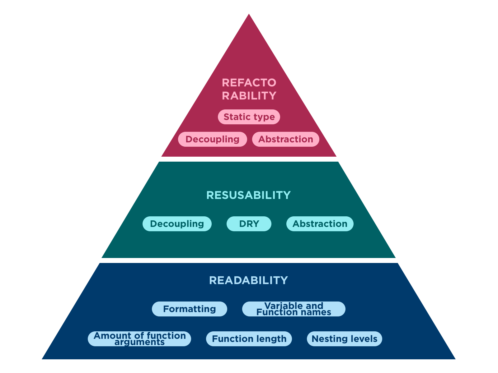

Original authors: [Ryan McDermott](https://github.com/ryanmcdermott) and [Burak Sonmez](https://github.com/bsonmez). See forked project for the original unedited text and the licence for more info.

# 3 Rs of Software Architecture



## Introduction

### Software Architecture

After 50+ years of software engineering's existence, we haven't settled on an exact definition of what software architecture is. After all, it is the art in computer science -- persistently evading our most determined of efforts to define it. Even still, it's so vital to the fabric of our industry and applications, that it's impossible to ignore.

Despite our lack of agreement, there are a lot of definitions that can help bring us closer to a formalization of software architecture. Perhaps the most notable of such comes from the IEEE:

> "Architecture is the fundamental organization of a system embodied in its components, their relationships to each other, and to the environment, and the principles guiding its design and evolution." [IEEE 1471]

While this definition and others can bring clarity to the elements that make up architecture, it doesn't give us a mental model to use when developing our applications. This project however, aims to give just that. By looking at 3 particular "ilities" (readability, reusability, and refactorability), we can form a hierarchy of architectural attributes that can give us a framework for thinking about our system's code and architecture. It won't give you an architecture per se, but it will guide you in thinking about what architecture works for your application.

### What is This Project?

This project is a guide that attempts to analyze 3 "ilities" of software architecture (readability, reusability, and refactorability), and show how we can form better code by thinking through these concepts hierarchically. This project is for any developer of any skill level, but if you are just starting out you will find more value in this than a seasoned practitioner.

The code we will be looking at is a very simple shopping cart application written in JavaScript, which makes use of two major libraries in the ecosystem: React and Context API. JavaScript and the aforementioned tools are by no means the only way to structure any particular application. They happen to be used by a lot of newcomers to the industry, and by many veterans as well, so their frequency of usage makes them a wonderful common language by which to discuss code quality. We will be developing our application one piece at a time and looking at Bad vs. Good versions at each step in 3 R hierarchy. You can find all the code in the `src` directory, and instructions about how to build this and develop on it are at the bottom of this README.

One more thing to reiterate: this project isn't the only way to look at software, and it certainly can't give you an architecture, but it's something that can hopefully guide your thinking, as it has guided mine.

Without further ado, let's get started!

---

## 1. Readability

### About

Readability is the simplest way of assessing code quality and it's the most straightforward to fix. It is the most obvious thing you see right when you open up a piece of code, and it generally consists of:

1. Formatting
1. Variable and Function names
1. Amount of function arguments
1. Function length (number of lines)
1. Nesting levels

These aren't the only things to consider, but they are immediate red flags. Fortunately, there are a few easy rules to follow to fix problems associated with those above:

1. **Formatting:** Invest in an automatic formatter. Find one your team agrees on and integrate it into your build process. There's nothing that wastes more time and money during code reviews than formatting arguments. Get a formatter and never look back! In this project we will use [Prettier](https://prettier.io).
1. **Variable and Function names:** Use meaningful and pronounceable variable and function names. Code is for people, and only incidentally for computers. Naming is the biggest thing that communicates the meaning behind your code.
1. **Amount of function arguments:** Limit your function arguments to between 1-3. Having 0 arguments implies you're mutating state or relying on state coming from somewhere else other than your caller. More than 3 arguments is just plain hard to read. Refactoring becomes difficult because there are so many paths your function can take the more arguments it has, making unit testing even harder to implement.
1. **Function length:** The main point is that your function should do ONE thing, and ONE thing only. If your function, which calculates the price of an item after taxes, first has to connect to the database, look up the item, get the tax data, and then do the calculation, then it's clearly doing more than one thing. Long functions typically indicate too much is happening.
1. **Nesting levels:** More than two levels of nesting can imply poor performance (in a loop), and it can be especially hard to read in long conditionals. Consider extracting nested logic into separate functions.

### In practice

Let's take a look at this first piece of our shopping cart application, to see what bad readability looks like.

[Right click and choose open in a new tab.](./src/1-readable/bad/App.jsx)

There are a number of problems we can see right away:

1. Inconsistent and unpleasant formatting.
1. Poorly named variables.
1. Comments that are either unnecessary or serve the job of what a good variable name would.

Let's take a look at how we could improve it:

[Right click and choose open in a new tab.](src/1-readable/good/App.jsx)

This improved code now exhibits the following features:

1. It is consistently formatted using the automatic formatter Prettier.
1. Names are much more descriptive.
1. Comments are no longer needed because good naming serves to clarify the meaning of the code. Comments are needed when business logic is complex and when documentation is required.

---

## 2. Reusability

### About

Reusability is the sole reason you are able to read this code, communicate with strangers online, and even program at all. Reusability allows us to express new ideas with little pieces of the past.

That is why reusability is such an essential concept that should guide your software architecture. We commonly think of reusability in terms of [DRY](https://en.wikipedia.org/wiki/Don%27t_repeat_yourself) (Don't Repeat Yourself). That is one aspect of it -- don't have duplicate code if you can abstract it properly. Reusability goes beyond that though. It's about making clean, simple API's that make your fellow progammer say, _"Yep, I know exactly what that does!"_ Reusability makes your code a delight to work with, and it means you can ship features faster.

### In practice

We will look at our previous example and expand upon it by adding a currency converter to handle our inventory's pricing in multiple countries:

[Right click and choose open in a new tab](src/2-reusable/bad/App.jsx)

This code works, **but merely working is not the point of coding**. That's why we need to look at this with a stronger lens than just analyzing if it works and it's readable. We have to look if it's reusable. Do you notice any issues?

Think about it!

Alright, there are 3 main issues in the code above:

1. The Currency Selector is coupled to the Inventory component.
1. The Currency Converter is coupled to the Inventory component.
1. The Inventory data is defined explicitly in the Inventory component and this isn't provided to the component using an external API.

Every function and module should just do one thing, otherwise it can be very difficult to figure out what is going on when you look at the source code. The Inventory component should just be for displaying an inventory, not converting and selecting currencies. The benefit of making modules and functions do one thing is that they are easier to test and they are easier to reuse. If we wanted to use our Currency Converter in another part of the application, we would have to include the whole Inventory component. That doesn't make sense if we just need to convert currency.

Let's see what this looks like with more reusable components:

**Project structure:**

- `currency-converter.js` ([right click to open](src/2-reusable/good/currency-converter.js))
- `App.jsx` ([right click to open](src/2-reusable/good/App.jsx))
- `CurrencySelector.jsx` ([right click to open](src/2-reusable/good/CurrencySelector.jsx))
- `Inventory.jsx` ([right click to open](src/2-reusable/good/Inventory.jsx))

This code has improved a great deal. Now we have individual modules for **currency selection** and **currency conversion**. Moreover, we can now provide the inventory data to our Inventory component. That means that we could download the inventory data, for example, and provide it to the Inventory component without ever having to modify its source code. This decoupling is the [Dependency Inversion Principle](https://en.wikipedia.org/wiki/Dependency_inversion_principle), and it's a powerful way of creating reusable code.

Now, it's time for a bit of caution. Before diving in and making everything reusable, it's important to realize that reusability requires that you have a good API for others to consume. If you don't, then whoever uses your API could be hurt when you go to update it because you realize it wasn't thought out well enough. So, when should code NOT be reusable?

- If you can't define a good API yet, don't make a separate module. Duplication is better than a bad foundation.
- You don't expect to reuse your function or module in the near future.

---

## 3. Refactorability

### About

Code that is refactorable is code that you can change without fear. It's code that you can deploy on a Friday night, and come back to on Monday morning without any concern that your users encountered runtime errors.

Refactorability is about the system as a whole. It's about how your reusable modules connect together like LEGO pieces. If you change your Employee module and somehow it breaks your Reporting module, then you know you have some refactorability issues. Refactorability is the highest piece of the 3 R hierarchy, and it's the hardest to achieve and maintain. There will always be issues with any human system, and code is no different. However, there are things that we can do to make our code refactorable. So, what are they?

1. Static types
1. Isolated side effects
1. Tests (shown after the practice exercice)

#### 1. Static types

We are using JavaScript, and not a typed alternative such as TypeScript, so we won't be able to see how static types can help. Suffice it to say, when your code has types, such as you see below, you know that nobody can pass incorrect values to your code, which limits the number of possible errors your app can experience:

```javascript
// TypeScript code
// We can't get passed arrays, strings, objects, or any type other than a number
function add(a: number, b: number) {
  return a + b;
}
```

I highly recommend using a statically typed alternative to JavaScript for large applications. Types give you extra confidence beyond what your tests can provide. But types won't help everything, you still need to isolate your side effects and test your code.

You might be wondering, what does it mean to isolate your side effects? And you might be asking what are side effects even?

#### 2. Isolated side effects

A _side effect_ is when your function or module modifies data outside the scope of itself. If you are writing data to a disk, changing a global variable, or even printing something to the terminal, you have a side effect. Now, if your program has no side effects at all then it's a black box. Programs are instructions that a computer executes which take data in and produce data out. If there's no data going out, then a program isn't useful. But, for a program to produce data it has to modify something in the world outside itself. For this reason we need side effects, but we also need to isolate them, by moving them in a separate place, safe from the rest of the code.

**Why should we isolate side effects?**

- Side effects make our code hard to test, because if a function's execution modifies some data that another function depends on then we can't be sure that a function will always give the same output with the same given input.
- Side effects introduce coupling between otherwise reusable modules. If module A modifies some global state that module B depends on, then A has to be run before B.
- Side effects make our system unpredictable. If any function or module can manipulate the state of the application, then we can't be sure how us updating one module will affect the whole system.

How do we isolate side effects? The answer is by making one central place to update global state of our application. There are many great ways to do this for a client-side JavaScript application, but for this project we will use Context API.

### In practice

We will modify our existing code to incorporate a shopping cart. Let's take a look at this new code and see why it's NOT refactorable:

**Project structure:**

- `currency-converter.js`
- `App.jsx`
- `CurrencySelector.jsx`
- `Cart.jsx` (new) ([right click to open](src/3-refactorable/bad/Cart.jsx))
- `Inventory.jsx` (modified) ([right click to open](src/3-refactorable/bad/Inventory.jsx))

Here we have a new shopping cart module that shows the inventory items currently in the shopping cart. There are two very problematic things in this code, what are they?

Think about it!

The two main issues with the code above are:

- The shopping cart is written to a global variable: `window.cart`
- The cart is updated by continuously reading from the global `window.cart`, which introduces a coupling to timing.

Even though our modules are reusable and readable, by writing to global variables we are making our overall system very brittle. Any third-party library that we bring in could overwrite our `window.cart` with something else and break our app. Furthermore, any module we write can access it and modify it without any safeguards or centralized way of updating.

You might be saying, _"Yeah, yeah I would never structure my app like this in the first place."_ That's great! Remember though, that even though this is exaggerated, the point is that the way the cart is updated and read **is not centralized**.

We will centralize our state management using Context API. If you haven't used Conext API before, [check out the official documentation](https://reactjs.org/docs/context.html).

Let's see what this more refactorable code looks like:

**Project structure:**

- `src/3-refactorable/good/components/Cart.jsx`
- `src/3-refactorable/good/components/CurrencySelector.jsx`
- `src/3-refactorable/good/components/Inventory.jsx`
- `src/3-refactorable/good/scripts/currency-converter.js`
- `src/3-refactorable/good/state/cart-reducer.js` (new) ([right click to open](src/3-refactorable/state/cart-reducer.js))
- `src/3-refactorable/good/state/CartProvider.jsx` (new) ([right click to open](src/3-refactorable/state/CartProvider.jsx))

This improved code centralizes our side effects to an `switch` function which takes a `action type` in and passes it to our `reducer` which creates an entirely brand-new cart with this product added to it. This new cart is placed in our `cart` located in `state/CartProvider.jsx`, and once that happens all of our components which derive their state from particular pieces of this `provider` will be notified by of the new data, and they will update their state. React will intelligently re-render each updated component, and that's it!

This flow makes it possible to be sure that the state of your application can only be updated in one way, and that's through the _action type_ -> _reducer_ -> _provider_ -> _component_ pipeline. There's no global state to modify, no messages to pass and keep track of, and no uncontrolled side effects that our modules can produce. The best part is, we can keep track of the entire state of our application so debugging and QA can become much easier, because we have an exact snapshot in time of our entire application.

One caveat to note: you might not need Context API in this project's example application, but if we were to expand this code it would become easier to use it as the state management solution instead of putting everything in the top-level controlling file `App.jsx`. We could have isolated the state of our app there and passed the appropriate data-modifying action functions down through each module. The issue with that is that at scale, we would have a lot of actions to pass down and a lot of data that would live in one massive `App.jsx`. By committing to a proper centralization of state early, we won't need to change much as our application growths.

#### 3. Test (Pending for when we reach this chapter)

The last thing we need to look at is tests. Tests give us confidence that we can change a module and it will still do what it was intended to do. We will look at the tests for the Cart and Inventory components:

**Testing files:**

- `src/test/cart.test.js`
- `src/test/inventory.test.js`

These tests ensure that the Cart and Inventory components:

- Show the data they are supposed to
- Maintain a consistent API
- Can modify state by calling a given action function

## Final Thoughts

Software architecture is the stuff that's hard to change, so invest early in a readable, reusable, and refactorable foundation. It will be hard to get there later on. By following the 3 Rs, your users will thank you, your developers will thank you, and you will thank yourself.

---

## Development

Thank you for reading this! If you wish to expand on this project or contribute, run the following commands to install everything you need:

```
npm install
npm run start
```

Open a browser and see the app running at `http://localhost:3000/`

---

## License

MIT
